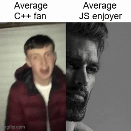

<!---->

# Praneeth Rangarajan
> CS grad from GSU, pursuing an M.S. in fintech at KSU. Founder of Qubit LLC. Here is my [resume](https://github.com/rangarajanpraneeth/resume/blob/main/resume.pdf).

<!--- real-time data systems & applied ML for trading -->

<!--
## Currently Building

[sim-racing-telemetry]() - Modular telemetry and hardware control platform for sim rigs, pulling live data from Assetto Corsa and Assetto Corsa Competizione into a customizable monitoring dashboard while interfacing with actuators, bass shakers, and other hardware.

[midas]() - Modular algorithmic trading platform for researching, testing, and running systematic strategies, combining market data, signal generation, portfolio management, and automated execution.
-->

<!--

-->
